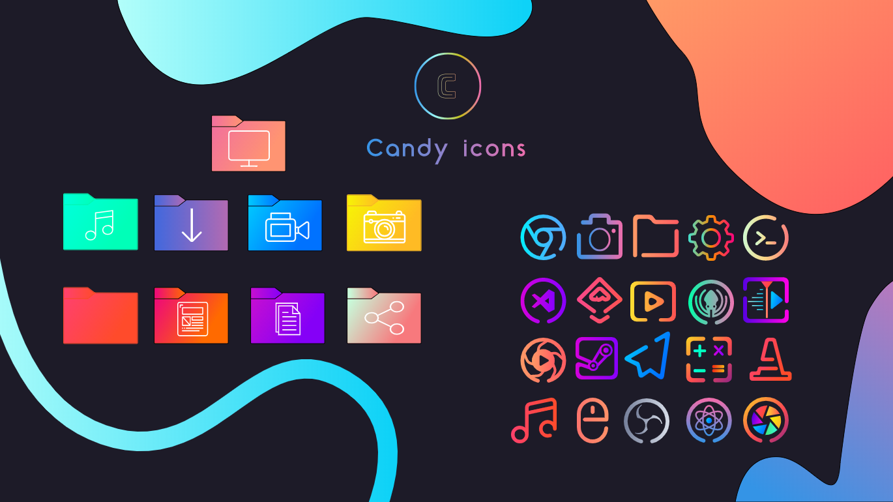

# Upgrading Icons

To upgrade icons without having to download the entire folder again, simply save the specific icon you are looking for.
Then copy the icon to your icons folder.

# Icons I've Added
- Firefox
- Retroarch Ver 1.0
